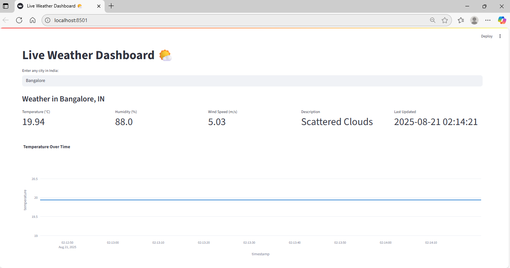
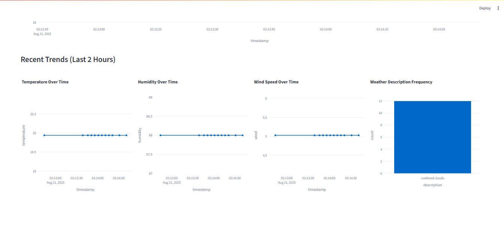

🌤️ Real-Time Weather Dashboard

A real-time weather analytics dashboard built with Python, Streamlit, and OpenWeather API. The project integrates MySQL database for historical logging, provides interactive visualizations with Plotly, and is fully containerized using Docker & Docker Compose for reproducible deployments.

🚀 Features

🌍 Fetches real-time weather data from OpenWeather API

📊 Interactive dashboards for temperature, humidity, and weather conditions

🗄️ MySQL database integration for storing weather history

🔄 Auto-refreshing updates for live monitoring

🐳 Dockerized full stack with docker-compose (App + MySQL)

🎨 Built with Streamlit + Plotly for a modern UI

🛠️ Tech Stack

Frontend: Streamlit, Plotly

Backend: Python (Requests, Pandas, SQLAlchemy)

Database: MySQL

DevOps: Docker, Docker Compose

Version Control: GitHub

📂 Project Structure
├── app.py                # Main Streamlit app
├── requirements.txt      # Python dependencies
├── Dockerfile            # Streamlit app container
├── docker-compose.yml    # Multi-container setup (App + MySQL)
├── README.md             # Project documentation

⚡ Getting Started
1. Clone the Repo
git clone https://github.com/<your-username>/weather-dashboard.git
cd weather-dashboard

2. Run with Docker Compose
docker-compose up --build

The Streamlit app will be available at:
👉 http://localhost:8501

MySQL will run at:
👉 localhost:3306

## 📸 Screenshots

### Dashboard Overview

### Live Charts

### Dashboard Overview

### Live Charts

